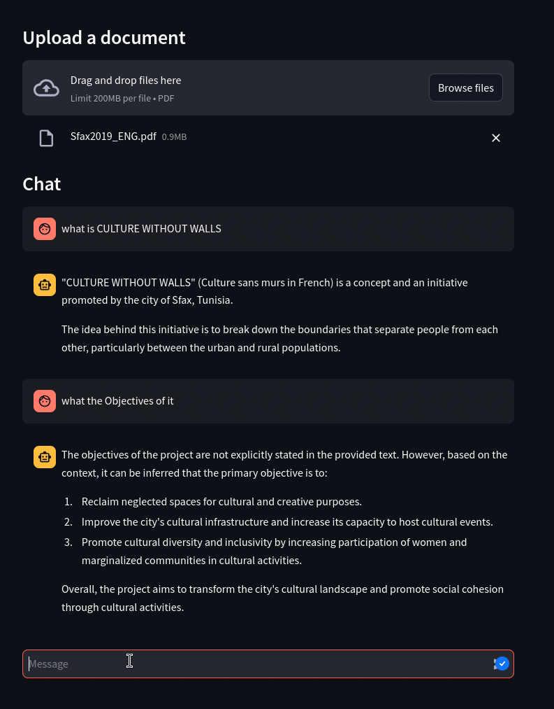
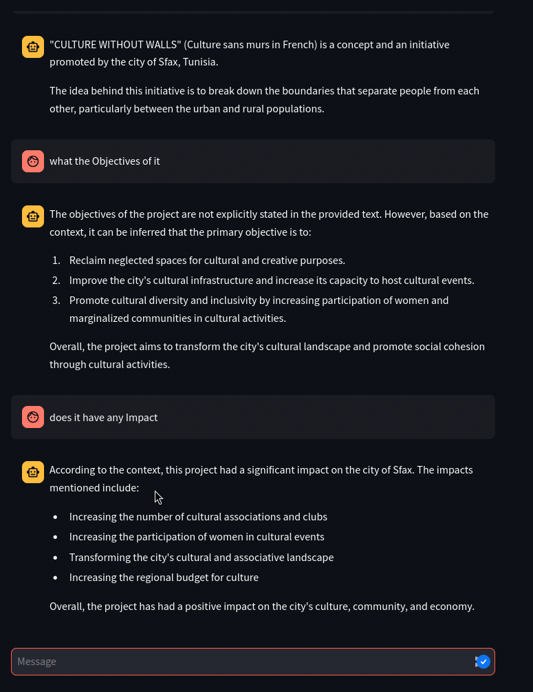

# ChatPDF Project

ChatPDF is a document-based AI assistant powered by large language models. It allows users to upload PDF files and interact with their content through a chatbot interface. The assistant is capable of retrieving relevant information from the uploaded documents and answering questions related to the content.



## Features

- **PDF Ingestion**: Upload PDF documents to be ingested by the assistant for context-based questioning.
- **Chat-based Interaction**: Ask questions regarding the content of the uploaded PDFs, and the assistant provides concise answers.
- **GPU-Optimized**: Uses CUDA-enabled GPUs for fast processing (supports NVIDIA hardware).
- **Streamlit Interface**: Provides a user-friendly web interface for interacting with the assistant.
- **Advanced Vector Search**: Uses FAISS to create and query a vector store for fast retrieval of relevant information from documents.
- **Custom Llama Model**: Leverages the Llama model and embeddings for high-performance text embedding and question answering.

## Docker Installation (Using Docker Compose)

To run the ChatPDF project in a Docker environment with GPU support, follow the steps below:

### Prerequisites

- Docker and Docker Compose installed.
- An NVIDIA GPU with the NVIDIA Docker runtime enabled.
- NVIDIA Driver and nvidia-container-toolkit.

### Important Note on GPU Support in Docker Desktop (Windows)

GPU support may not work as expected under Docker Desktop for Windows because it relies on a virtualization layer, and Windows doesn't natively support CUDA-enabled containers. For GPU support, Docker Desktop for Windows users may need to use a Linux-based system or Windows Subsystem for Linux (WSL 2) with proper GPU pass-through configurations. If you don't have an NVIDIA GPU or can't enable GPU support, you can still run the project in CPU mode.

### Steps

1. **Clone the repository** (if you haven't already):

   ```bash
   git clone https://github.com/habib-source/pdf-rag.git
   cd pdf-rag
   ```

2. **Build and run the Docker container**:

   ```bash
   docker-compose up --build
   ```

   This will:

   - Build the Docker image based on the `Dockerfile`.
   - Start the services defined in the `docker-compose.yml` file.
   - Expose the Streamlit application on port `80`.

3. **Access the web interface**:

   Once the services are up, you can access the ChatPDF interface by navigating to `http://localhost` in your web browser.

4. **Stop the container**:

   To stop the container, use:

   ```bash
   docker-compose down
   ```

---

## Manual Installation (Using Python Virtual Environment)

If you prefer to set up the project manually, follow these instructions:

### Prerequisites

- Python 3.12
- A virtual environment manager (`venv`).
- CUDA 12 and necessary libraries for GPU support.

### Steps

1. **Clone the repository**:

   ```bash
   git clone https://github.com/your-repository-url.git
   cd your-repository-directory
   ```

2. **Create and activate a Python virtual environment**:

   ```bash
   python3 -m venv env
   source env/bin/activate  # For Linux/macOS
   .\env\Scripts\activate  # For Windows
   ```

3. **Install the dependencies**:

   Make sure you have the required dependencies listed in `requirements.txt`:

   ```bash
   CMAKE_ARGS="-DGGML_CUDA=on" pip install -r requirements.txt
   ```

4. **Download the models**:

   You can manually download the necessary models using the following links:

   - [Llama Model](https://huggingface.co/bartowski/Llama-3.2-3B-Instruct-GGUF/resolve/main/Llama-3.2-3B-Instruct-Q4_K_M.gguf)
   - [Embed Model](https://huggingface.co/nomic-ai/nomic-embed-text-v1.5-GGUF/resolve/main/nomic-embed-text-v1.5.f32.gguf)
   After downloading, you need to rename the model files to match the following names:

   - Rename the Llama model to model.gguf .
   - Rename the Embed model to embed.gguf .

   Place the renamed models (model.gguf and embed.gguf) in your project directory.

5. **Run the Streamlit application**:

   You can now run the application using:

   ```bash
   streamlit run ui.py
   ```

6. **Access the web interface**:

   Open your browser and go to `http://localhost:8501` to interact with the assistant.

7. **Stop the application**:

   Press `Ctrl+C` in the terminal to stop the Streamlit app.

---

## File Structure

```plaintext
.
├── Dockerfile                  # Dockerfile for setting up the container
├── docker-compose.yml          # Docker Compose file to manage services
├── requirements.txt            # Python dependencies
├── ui.py                       # Streamlit application
├── ChatPDF.py                  # Core logic for PDF ingestion and Q&A
├── embed.gguf                  # Llama Embedding Model
├── model.gguf                  # Llama Model
└── README.md                   # Project documentation (this file)
```

---

## Troubleshooting

- **Error: `nvidia-docker` not found**:
   Ensure that Docker is set up correctly with the NVIDIA runtime. You may need to install the [NVIDIA Container Toolkit](https://docs.nvidia.com/datacenter/cloud-native/container-toolkit/1.11.0/install-guide.html).


---

## Contributing

We welcome contributions! Please fork the repository, create a feature branch, and submit a pull request with your changes. If you have any issues or feature requests, feel free to open an issue on GitHub.

---

## License

This project is licensed under the MIT License - see the [LICENSE](LICENSE) file for details.

---
